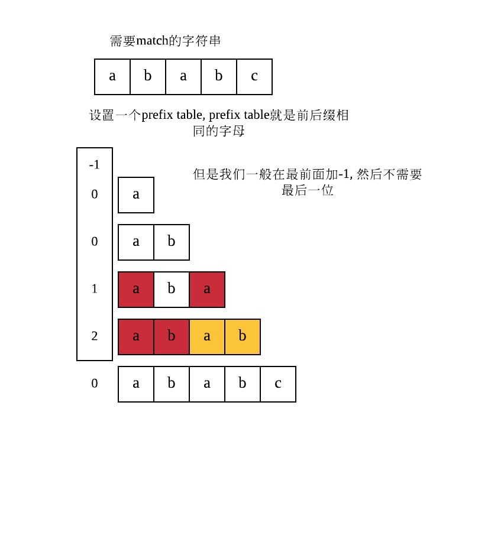
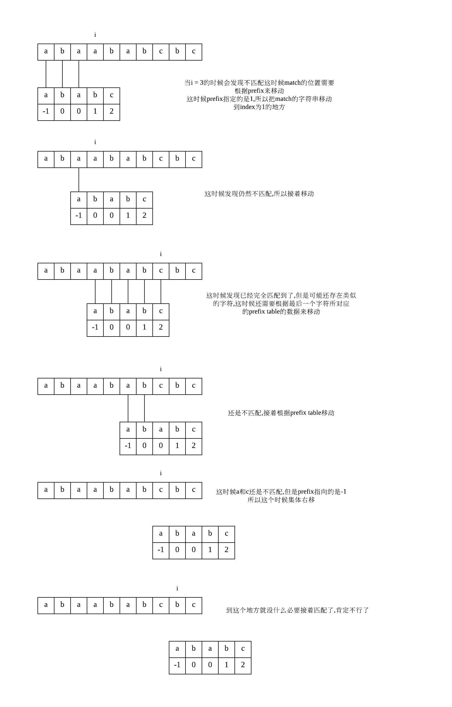

# KMP 算法
Worst case: $O(m+n)$

Two stages:
- Pre-processing: table building O(m)
- Matching: O(n)

Space complexity: O(m)

**首先需要制作一个prefix table: **

这个是根据字符串的前后字符有一个相等的, `i-len`

这样的话我们的prefix就制作好了`-1,0,0,1,2`.

然后我们需要根据这个table来进行KMP的search的算法:


具体的实现代码:
```java
package KMP;

import java.util.Arrays;

public class KMP {

    public int[] prefix(String str) {
        int[] prefix = new int[str.length()];

        // 左右最长公共后缀, 左右两边肯定相等的
        prefix[0] = 0;
        int len = 0;
        int i = 1;

        while (i < str.length()) {
            if (str.charAt(i) == str.charAt(len)) {
                len ++;
                prefix[i] = len;
                i ++;
            } else {
                if (len > 0) {
                    len = prefix[len - 1];
                } else {
                    prefix[i] = len;
                    i ++;
                }
            }
        }
        move(prefix);
        return prefix;
    }

    public void move(int[] prefix) {
        if (prefix.length - 1 >= 0) System.arraycopy(prefix, 0, prefix, 1, prefix.length - 1);
        prefix[0] = -1;
    }

    public void kmp_search (String text, String match) {
        int[] prefix = prefix(match);
        System.out.println(Arrays.toString(prefix));

        // text lens n index i
        // prefix len m index j
        int i = 0;
        int j = 0;
        while ( i < text.length()) {
            if (j == match.length() - 1 && text.charAt(i) == match.charAt(j)) {
                System.out.println(text.substring(i - j, i));
                j = prefix[j];
            }
            if (text.charAt(i) == match.charAt(j)) {
                i ++;
                j ++;
            } else {
                j = prefix[j];
                if (j == -1) {
                    j ++;
                    i ++;
                }
            }
        }
    }

    public static void main(String[] args) {
        String str = "ababcabaa";
        String text = "abababcabaaabababababa";
        KMP kmp = new KMP();
        kmp.kmp_search(text, str);
    }
}
```
